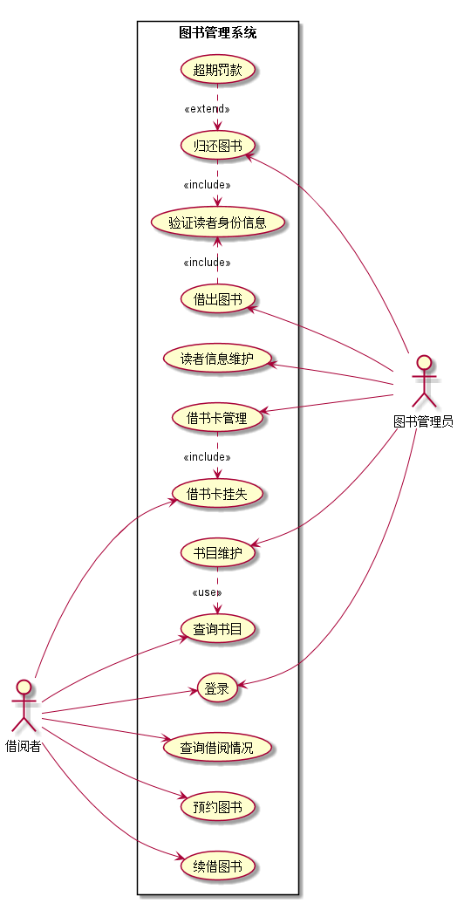

# 实验二：图书管理系统用例建模
|        学号      |     班级    |    姓名    |
|:----------------:|:-----------:|:----------:|
|   201510414301   |    软工15-3 |    程鑫凯  | 
## 1.图书管理系统的用例关系图
### 1.1用例图PlantUML源码如下：
    @startuml
    
    left to right direction
    :借阅者: as User
    :图书管理员: as Admin
    
    rectangle 图书管理系统 {
    User ---> (登录)
    User ---> (查询借阅情况)
    User ---> (预约图书)
    User ---> (续借图书)
    User ---> (查询书目)
    User ---> (借书卡挂失)
    (借出图书).>(验证读者身份信息):<<include>>
    (借出图书) <- Admin
    (验证读者身份信息)<.(归还图书):<<include>>
    (归还图书)<.(超期罚款):<<extend>>
    (归还图书) <- Admin
    (读者信息维护) <- Admin
    (借书卡管理) <- Admin
    (借书卡挂失)<.(借书卡管理):<<include>>
    (登录)<--- Admin
    (书目维护) <--- Admin
    (查询书目)<.(书目维护):<<use>>
    }
    @enduml
### 1.2用例图如下：

## 2.参与者说明
### 2.1 图书管理员
主要职责是：对图书的维护及管理，对用户借记卡的管理，以及对读者的借出、还书等操作进行处理。
### 2.2 借阅者
主要职责是：可以通过查询图书并借取或者归还图书，也可查询自己的借阅情况。若借记卡不慎丢失，可进行挂失并找管理员进行补卡操作。
## 3.用例规约表
### 3.1 "借出图书"用例
| ||
|:------:|:------:|
|用例名称|借出图书|  
|参与者|图书管理员（主要参与者）、借阅者（次要参与者）|
|前置条件|图书管理员已被识别和授权|
|后置条件|存储借书记录，更新库存数据，所借图书状态为借出|
|主事件流|1.图书管理员将读者借书卡提供给系统；2.系统验证读者身份和借书条件；3.图书管理员将读者所借图书输入系统；4.系统记录借书信息，并且修改图书的状态和此书的可借数量；5系统累加读者的借书数量；6.重复3~5，直到图书管理员确认全部图书登记完毕；7.系统打印借书清单，交易成功完成|
|备注|无|
 ### 3.2 "归还图书"用例
 | ||
 |:------:|:------:|
 |用例名称|归还图书|  
 |参与者|图书管理员（主要参与者）、借阅者（次要参与者）|
 |前置条件|图书管理员已被识别和授权|
 |后置条件|存储还书记录，更新库存数据，所借图书状态为未借出|
 |主事件流|1.图书管理员将读者借书卡提供给系统；2.系统验证读者身份和还书条件；3.图书管理员将读者所借图书输入系统；4.由系统计算出图书所借日期是否逾期，若逾期则需要借阅者缴纳逾期罚款 5.系统记录还书信息，并且修改图书的状态和此书的可借数量；6.系统打印还书清单，交易成功完成|
 |备注|无|
