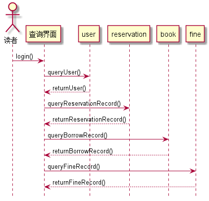

# 实验四：图书管理系统顺序图绘制
|        学号      |     班级    |    姓名    |
|:----------------:|:-----------:|:----------:|
|   201510414301   |    软工15-3 |    程鑫凯  | 

### 1.借书顺序图
#### 1.1 借书顺序图PlantUML源码：
    @startuml
    hide footbox
    actor 读者
    actor 管理员
    读者 -> 管理员:需借书目
    管理员->借书系统 : login()
    管理员->借书系统 : show_reader()
    管理员->借书系统 : 1:check()
    借书系统 -> loan :borrow()
    loan -> user :getreader()
    loan -> user :2:check()
    loan -> copy_book : getbookinf()
    copy_book -> reservation :3:check()
    copy_book <-- reservation :1:isBorrow()
    loan -> book :bulidinf()
    借书系统 <-- loan :2:isBorrow()
    管理员 <-- 借书系统 :3:isBorrow()
    读者 <-- 管理员 :4:isBorrow()
    @enduml
#### 1.2 顺序图如下：

#### 1.3 借书顺序图说明：
    1、 login（）：读者将需借书目交给管理员，管理员登陆系统。
    2、 show_reader()：显示读者的信息的函数。 
    3、 check（）：验证读者是否有借书的权利。
    4、 borrow（）：读者借书函数。 
    5、 getreader（）：获取读者信息的函数。 
    6、 check（）：检验读者是否符合借书条件函数。
    7、 getbookinf（）：获取书目信息函数。 
    8、 check（）：检查书籍是否被预约的函数。 
    9、 isBorrow()：返回未被预约函数。
    10、 builtinf()：建立借阅信息函数。 
    11、 isBorrow()：返回借阅信息函数。 
    12、 isBorrow()：返回借阅成功函数。
    13、 isBorrow()：借阅成功，将书交给读者。
### 2.还书顺序图
#### 2.1 还书顺序图PlantUML源码：
    @startuml
    hide footbox
    actor 读者
    actor 管理员
    读者 ->  管理员 :还书
    管理员 -> 还书界面 :login()
    还书界面 -> book :getbookinf()
    还书界面 -> loan :getborrowinf()
    还书界面 -> loan :getborrowDate()
    还书界面 -> loan :getnowDate()
    还书界面 -> loan :isOverDate()
    还书界面 -> loan :work()
    还书界面 <-- loan :return()
    管理员 <-- 还书界面 :return()
    @enduml
#### 2.2 顺序图如下：

#### 2.3 还书顺序图说明：
    1、 login()：读者将书籍交给管理员，管理员登录系统。 
    2、 getbookinf()：管理员扫描条形码，获取书籍信息函数。 
    3、 getborrowinf()：获取借阅信息函数。
    4、 getborrowDate()：获取借阅时间函数。 
    5、 getnowDate()：获取现在时间函数。 
    6、 isOverDate():是否超出借阅时间函数。 
    7、 work()：处理函数，处理时间差。 
    8、 return()：消息返回。
### 3.预约图书顺序图
#### 3.1 预约图书顺序图PlantUML源码：
    @startuml
    hide footbox
    actor 读者
    读者 -> 图书管理系统 :login()
    图书管理系统 -> book :getbookinf()
    图书管理系统 -> copy_book :check()
    copy_book -> reservation : reservation()
    copy_book -> reservation : getbook()
    copy_book -> reservation : build()
    图书管理系统 <-- reservation
    读者 <-- 图书管理系统 :return()
    @enduml
#### 3.2 顺序图如下：

#### 3.3 预约顺序图说明：
    1、 login()：登录系统。 
    2、 getbookinf()：获取图书信息函数。 
    3、 check()：检查是否有图书可借函数。
    4、  reservation()：确定预约图书函数。
    5、  build()：建立预约信息函数。
    6、  getbook()：获取预约图书信息函数。
    7、  return()：返回消息。
### 4.查找用户个人信息顺序图
#### 4.1 查找用户个人信息顺序图PlantUML源码：
    @startuml
    hide footbox
    actor 读者
    读者 -> 查询界面 :login()
    查询界面 -> user:queryUser()
    查询界面 <-- user:returnUser()
    查询界面 -> reservation : queryReservationRecord()
    查询界面 <-- reservation : returnReservationRecord()
    查询界面 -> book : queryBorrowRecord()
    查询界面 <-- book : returnBorrowRecord()
    查询界面 -> fine : queryFineRecord()
    查询界面 <-- fine : returnFineRecord()
    @enduml
#### 4.2 顺序图如下：

#### 4.3 查找用户个人信息顺序图说明：
    1、  login()：登录系统。
    2、  queryUser()：查询账户信息函数。
    3、  returnUser()：返回账户信息消息。
    4、  queryReservationRecord()：查询预约记录函数。
    5、  returnReservationRecord()：返回用户预约信息。
    6、  queryBorrowRecord()：查询借书记录函数。
    7、  returnBorrowRecord()：返回用户借书信息。
    8、  queryFineRecord()：查询罚款记录函数。
    9、  returnFineRecord()：返回用户罚款信息。
### 5.查询图书顺序图
#### 5.1 查询图书顺序图PlantUML源码：
    @startuml
    hide footbox
    actor 读者
    actor 管理员
    actor 系统管理员
    读者 -> 资源项 : getResItem()
    管理员 -> 资源项 : getResItem()
    系统管理员 -> 资源项 : getResItem()
    资源项 -> 馆藏资源 : queryKinds()
    馆藏资源 -> book :getbookinf()
    系统管理员 <-- book :return()
    管理员 <-- book :return()
    读者 <-- book :return()
    @enduml
#### 5.2 顺序图如下：

#### 5.3 查询图书顺序图说明：
    1、  getResItem()：获取资源项函数。
    2、  queryKinds()：查询图书资源种类函数。
    3、  getbookinf()：获取图书信息函数。
    4、  return()：返回图书信息消息。