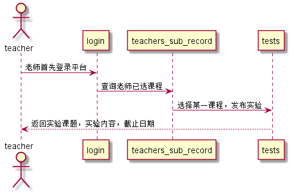

# “发布实验课题”用例 [返回](./README.md)
## 1. 用例规约
|用例名称|发布实验课题|
|-------|:-------------|
|功能|老师通过平台发布新实验|
|参与者|老师|
|前置条件|老师需要先登录并且有选课，进入指定课程选择发布实验|
|后置条件|实验发布完成后，刷新页面 |
|主流事件| |
|备注| |

## 2. 业务流程（顺序图） [源码](../src/punishNewLab.puml)
 

## 3. 界面设计
界面参照: https://acs121.github.io/is_analysis/test6/index.html
* API接口调用
  * 接口1:[punishNewLab](../接口/punishNewLab.md)

## 4. 算法描述（活动图）
- 无

## 5. 参照表

- teachers
- teachers_sub_record
- tests
