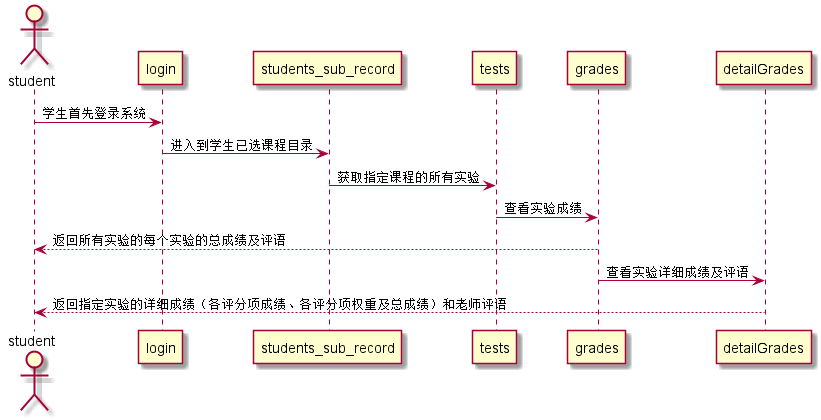

# “学生查看成绩”用例 [返回](./README.md)
## 1. 用例规约
|用例名称|学生查看成绩|
|-------|:-------------|
|功能|学生查看自己的实验成绩（可显示细节得分与评语）|
|参与者|学生|
|前置条件|学生需要先登录并且有选课|
|后置条件| |
|主流事件| |
|备注| |

## 2. 业务流程（顺序图） [源码](../src/studentQueryGrades.puml)
 

## 3. 界面设计
界面参照: https://chengxinkaicxk.github.io/is_analysis/test6/UI/studentquerygrades.html
* API接口调用
  * 接口1:[studentQueryGrades](../接口/studentQueryGrades.md)

## 4. 算法描述（活动图）
- 无

## 5. 参照表

- students_sub_record
- students
- tests
- grades 
- detailGrades
