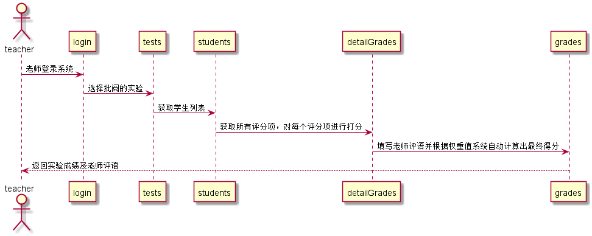

# “按评分项评定成绩”用例 [返回](../README.md)
## 1. 用例规约

|用例名称|按评分项评定成绩|
|-------|:-------------|
|功能|老师评定一个学生的实验成绩|
|参与者|老师|
|前置条件|查看成绩：评定成绩之前，老师需要先登录，并显示出评定实验的所有评选项和评语信息|
|后置条件| 评定成绩提交之后，系统自动设置成绩更新日期为当前日期，自动根据加权规则计算平均成绩|
|主事件流| 1. 登录并进入实验成绩评定界面   2. 对每个评分项进行打分并填写评语（评语可为空）    3. 提交    4. 系统存储实验成绩和评语  5. 系统自动计算平均成绩|
|备选事件流| |

## 2. 业务流程（顺序图） [源码](../src/reviewGrades.puml)
 

    
## 3. 界面设计
- 界面参照: https://chengxinkaicxk.github.io/is_analysis/test6/UI/reviewgrade.html

- API接口调用

    - 接口1：[reviewGrades](../接口/reviewGrade.md)
        
        用于按评分项评定学生实验成绩
        
    
## 4. 算法描述
    无
    
## 5. 参照表

- teachers
- students 
- tests
- detailGrades
- grades

