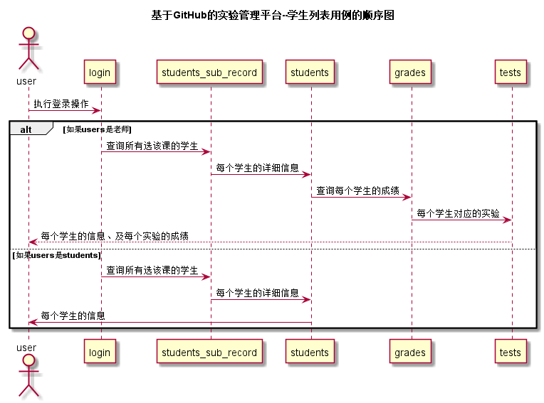

# “查看学生列表”用例 [返回](./README.md)
## 1. 用例规约
|用例名称|查看学生列表|
|-------|:-------------|
|功能|以表的形式显示出相关课程的所有学生|
|参与者|老师，学生|
|前置条件|老师和学生都需要先登录|
|后置条件| |
|主流事件| |
|备注| |

## 2. 业务流程（顺序图） [源码](../src/studentList.puml)
 

## 3. 界面设计
界面参照: https://acs121.github.io/is_analysis/test6/index.html
* API接口调用
  * 接口1:[getStudents](../接口/getStudents.md)

## 4. 算法描述（活动图）
- WEB_SUM解析为列表  
  - WEB_SUM是接口getStudents的返回值中的一部分，形如："WEB_SUM": "Y,Y,Y,Y,Y,N"。需要在前端进行解析。  
  - 作用是判断GitHub网址是否正确，用逗号分开，Y代表正确，N代表不正确。  
  - 第1位代表总的GitHUB地址是否正确，第2位表示第1次实验的地址，第3位表示第2位实验地址，依此类推。
  - 比如：“Y,Y,Y,Y,Y,N”表示第5次实验地址不正确，其他地址正确。  
  - 算法是使用使用字符串分离方法将其分开。

- RESULT_SUM解析为列表
    - RESULT_SUM是接口getStudents的返回值中的一部分，形如："RESULT_SUM": "81.25,70,80,85,90,N"。需要在前端进行解析。
    - 成绩汇总（来自GRADES表），以逗号分开，第一个成绩是平均成绩,后面是每次实验的成绩，N表示未批改，平均分只计算已批改的。    
    - 比如：“81.25,70,80,85,90,N”表示一共批改了4次，第5次未批改，4次的成绩分别是81.25,70,80,85,90,N，4次的平均分是81.25
    - 算法是使用使用字符串分离方法将其分开。

## 5. 参照表

- students_sub_record
- students
- grades
- tests
