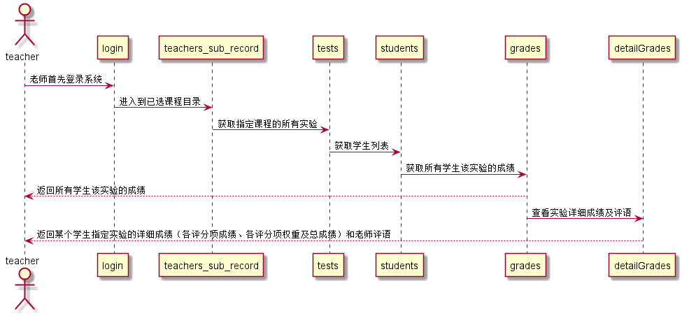

# “查看学生成绩”用例 [返回](./README.md)
## 1. 用例规约
|用例名称|查看学生成绩|
|-------|:-------------|
|功能|教师查看学生成绩情况（可显示细节得分与评语）|
|参与者|教师|
|前置条件|教师需要先登录且已有选课，已有发布的实验和选该课的学生|
|后置条件| |
|主流事件| |
|备注| |

## 2. 业务流程（顺序图） [源码](../src/queryStudentGrades.puml)
 

## 3. 界面设计
界面参照: https://chengxinkaicxk.github.io/is_analysis/test6/UI/teastudentlist.html
* API接口调用
  * 接口1:[queryStudentGrades](../接口/queryStudentGrades.md)

## 4. 算法描述（活动图）
- 无

## 5. 参照表

- teachers_sub_record
- teachers
- students
- tests
- grades 
- detailGrades
