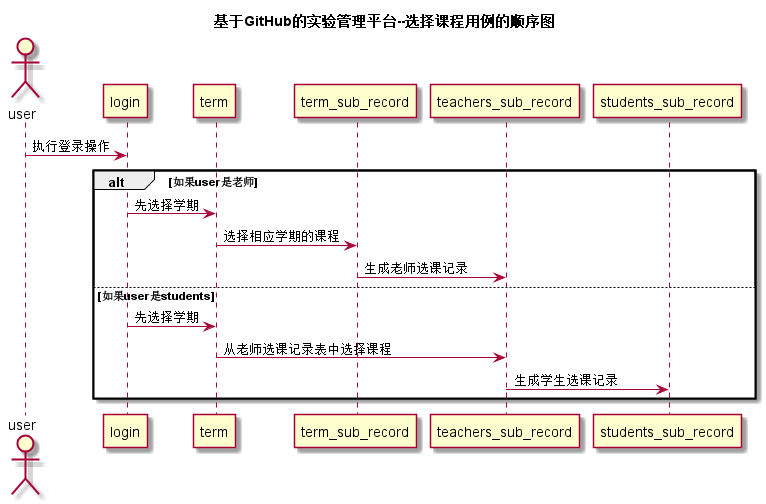

# “选择课程”用例 [返回](./README.md)
## 1. 用例规约
|用例名称|选择课程|
|-------|:-------------|
|功能|选择课程|
|参与者|老师，学生|
|前置条件|老师和学生都需要先登录，并且完成选择学期的步骤|
|后置条件| 老师和学生选课完成后，都会在表中生成相应的记录|
|主流事件| |
|备注| |

## 2. 业务流程（顺序图） [源码](../src/chooseSub.puml)
 

## 3. 界面设计
界面参照: https://acs121.github.io/is_analysis/test6/index.html
* API接口调用
  * 接口1:[chooseSub](../接口/chooseSub.md)

## 4. 算法描述（活动图）
* 老师或者学生首先需要进行登录，登录完成要进行选择学期。由于学期和课程之间有一个中间表term_sub_record，其中
记录了某一学期开设的课程，老师在此表中进行选课操作即可，选课完成，会生成中间表teachers_sub_record，保留了老
师和课程、学期之间的关系，接下来学生选课便在teachers_sub_record表中操作，即关联上了老师、课程和学期。
## 5. 参照表

- term
- students
- teachers
- term_sub_record
- teachers_sub_record
- students_sub_record

